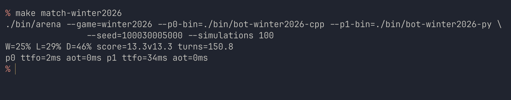

# CodinGame Arena

Local game engine runner for [CodinGame](https://www.codingame.com/) bot programming challenges. Run bot-vs-bot matches offline, analyze results, and watch replays in a built-in web viewer — all without the CodinGame platform.


## Features

- **Offline match runner** — execute thousands of matches locally with parallel workers
- **Match tracing** — save per-match JSON traces for replay and analysis
- **Built-in web viewer** — React + PixiJS viewer served from the binary, no extra setup
- **Replay downloader** — fetch replays from codingame.com for local viewing




## Supported Games

| Game                  | Flag                | Source              |
|-----------------------|---------------------|---------------------|
| Spring Challenge 2020 | `--game spring2020` | `games/spring2020/` |
| Winter Challenge 2026 | `--game winter2026` | `games/winter2026/` |

## Quick Start

### CLI Simulator

```shell
make build-arena
make build-winter2026-agents

bin/arena --game=winter2026 \
--p0-bin=bin/bot-winter2026-cpp \
--p1-bin=bin/bot-winter2026-py \
--seed=100030005000 --simulations 100

# W=25% L=29% D=46% score=13.3v13.3 turns=150.8
# p0 ttfo=2ms aot=0ms p1 ttfo=33ms aot=0ms
```

### Web Viewer

```shell
bin/arena serve
```

Open a web UI at `http://localhost:5757` where you can select bots, run matches, and watch replays.

## License

[MIT](LICENSE) © 2026 Dmitrii Barsukov
