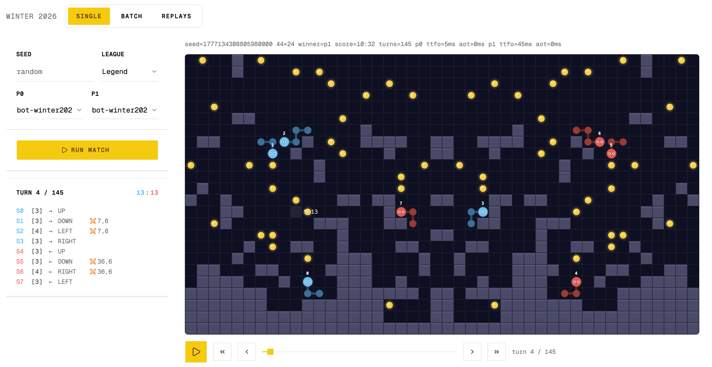
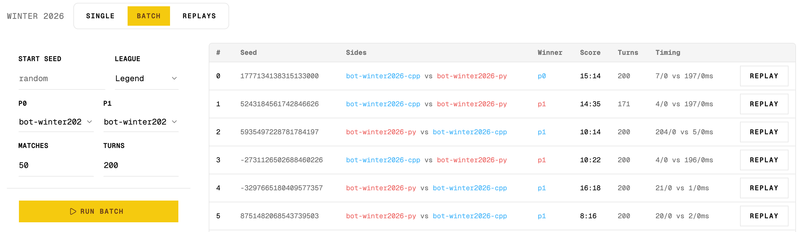

# CodinGame Arena

Local game engine runner for [CodinGame](https://www.codingame.com/) bot programming challenges. Run bot-vs-bot matches offline, analyze results, and watch replays in a built-in web viewer — all without the CodinGame platform.



## Features

- **Offline match runner** — execute thousands of matches locally with parallel workers
- **Match tracing** — save per-match JSON traces for replay and analysis
- **Built-in web viewer** — React + PixiJS viewer served from the binary, no extra setup
- **Replay downloader** — fetch replays from codingame.com
- **Replay conversion** — convert downloaded replay JSON into arena trace format
- **Trace analysis** — aggregate stats across batches of traces

```shell
$ bin/arena --game=winter2026 \
    --blue=bin/bot-winter2026-cpp \
    --red=bin/bot-winter2026-py \
    --seed=100030005000 --simulations 100

Summary: 100 matches played (3.15s)
Stats: wins=29% losses=32% draws=39% avg_score=16.4x17.0 avg_turns=155
Timing: avg_first_response=29msx198ms avg_turn_response=0msx0ms
```



## Supported Games

| Game                  | Flag                | Source              |
|-----------------------|---------------------|---------------------|
| Winter Challenge 2026 | `--game winter2026` | `games/winter2026/` |
| Spring Challenge 2020 | `--game spring2020` | `games/spring2020/` |

## Commands

| Command     | Purpose                                                 |
|-------------|---------------------------------------------------------|
| `run`       | Run one or more match simulations against a player      |
| `replay`    | Download replay JSON (`get`, `leaderboard` subcommands) |
| `convert`   | Convert replay JSON files into arena trace files        |
| `analyze`   | Analyze trace outcomes and game-owned metrics           |
| `serialize` | Print initial game input for first turn for a seed      |
| `serve`     | Serve the embedded web viewer                           |

Run `arena help <command>` for full flag listings.

## Quick Start

### Build

```shell
make build-arena
make build-winter2026-agents
make match-winter2026
```

### Web Viewer

```shell
bin/arena serve
```

Opens a web UI at `http://localhost:5757` where you can select bots, run matches, and watch replays.

## Configuration

Flags can be supplied via CLI, environment variables (`ARENA_<FLAG>`, hyphens become underscores — e.g. `ARENA_GAME`, `ARENA_SEED`), or an `arena.yml` config file in the current directory. See `arena.example.yml`.

## License

[MIT](LICENSE) © 2026 Dmitrii Barsukov
